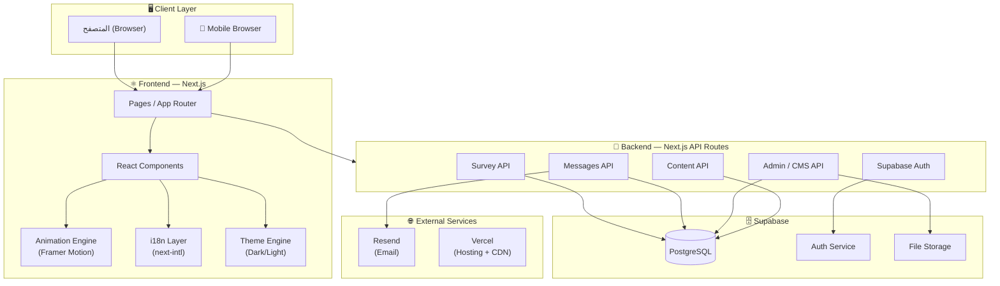
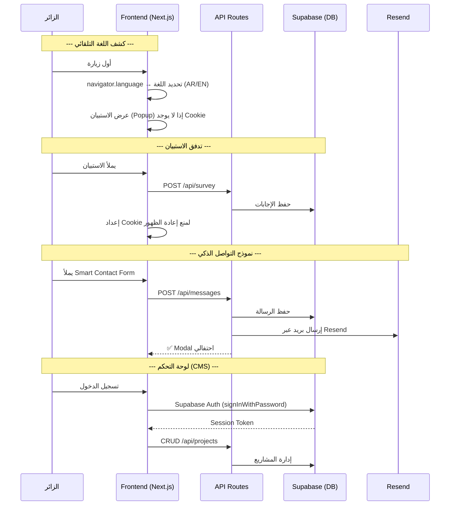

# 🏗️ System Architecture & Tech Stack
## Advanced Personal Page — v1.3

---

## 1. المخطط المعماري العام (High-Level Architecture)



---

## 2. الأساس التقني المعتمد (Confirmed Tech Stack)

> [!IMPORTANT]
> جميع التقنيات التالية **مؤكدة** من قبل صاحب المشروع ما لم يُذكر غير ذلك.

### Frontend

| المكوّن | التقنية | الحالة |
|---|---|---|
| **إطار العمل** | Next.js (App Router) | ✅ مؤكد |
| **المحرك الحركي** | Framer Motion (`useSpring`, `useTransform`) | ✅ مؤكد |
| **مكتبة 2.5D المساعدة** | Atropos.js أو Vanilla Tilt.js | ✅ مؤكد كبديل |
| **اللغة** | TypeScript | ✅ مؤكد (A-01) |
| **التنسيق** | CSS Modules أو Tailwind CSS | مستنتج |
| **i18n** | `next-intl` أو `next-i18next` | مستنتج — لدعم ثنائية اللغة |
| **الخط العربي** | **Readex Pro** (Google Fonts) | ✅ مؤكد |
| **الخط الإنجليزي** | **Plus Jakarta Sans** (Google Fonts) | ✅ مؤكد |

### Backend & Infrastructure

| المكوّن | التقنية | الحالة |
|---|---|---|
| **الاستضافة** | **Vercel** | ✅ مؤكد |
| **قاعدة البيانات** | **Supabase (PostgreSQL)** | ✅ مؤكد |
| **المصادقة** | **Supabase Auth** | ✅ مؤكد |
| **ORM** | Prisma (مع Supabase PostgreSQL) | ✅ مؤكد (A-03) |
| **API** | Next.js API Routes / Server Actions | متكامل |
| **تخزين الملفات** | Supabase Storage (صور المشاريع) | مستنتج — لدعم CMS |

### خدمات خارجية

| الخدمة | التقنية | الحالة |
|---|---|---|
| **إرسال البريد** | **Resend** | ✅ مؤكد |
| **التحليلات السلوكية** | 🆕 **Vercel Analytics** (مجاني، لا يستهلك DB) | ✅ مؤكد |
| **حماية الـ API** | 🆕 **Upstash Rate Limit** (مجاني مع Next.js) | ✅ مؤكد |
| **CDN** | Vercel Edge Network (مدمج) | تلقائي مع Vercel |
| **Image Optimization** | Next.js `next/image` + Vercel Image Optimization | تلقائي |

---

## 3. هيكل المشروع المقترح (Project Structure)

```
advanced-personal-page/
├── public/
│   ├── images/
│   │   ├── character/          # صورة الشخصية PNG الشفافة (2.5D)
│   │   └── static/             # أصول ثابتة عامة
│   └── locales/                # (احتياطي — حسب مكتبة i18n)
├── src/
│   ├── app/
│   │   ├── [locale]/           # 🌐 i18n — Dynamic locale routing
│   │   │   ├── layout.tsx
│   │   │   ├── page.tsx        # الصفحة الرئيسية (The Hook)
│   │   │   ├── journey/
│   │   │   │   └── page.tsx    # رحلتي (The Story)
│   │   │   ├── portfolio/
│   │   │   │   ├── page.tsx    # معرض المشاريع
│   │   │   │   └── [slug]/
│   │   │   │       └── page.tsx # صفحة المشروع التفصيلية
│   │   │   └── contact/
│   │   │       └── page.tsx    # التواصل (Smart Contact Form)
│   │   ├── admin/              # لوحة التحكم (خارج i18n)
│   │   │   ├── layout.tsx      # Layout محمي بـ Supabase Auth
│   │   │   ├── page.tsx        # لوحة التحكم الرئيسية
│   │   │   ├── projects/       # 🆕 CMS — إدارة المشاريع
│   │   │   ├── analytics/
│   │   │   ├── messages/
│   │   │   └── settings/
│   │   └── api/
│   │       ├── auth/
│   │       ├── survey/
│   │       ├── messages/
│   │       ├── projects/       # 🆕 CRUD API للمشاريع
│   │       └── admin/
│   ├── components/
│   │   ├── shared/             # Footer, Navbar, LanguageSwitcher, ThemeSwitcher
│   │   ├── home/               # Hero, CharacterParallax, CardShuffle
│   │   ├── journey/            # Timeline cards
│   │   ├── portfolio/          # Project cards, Gallery
│   │   ├── contact/            # SmartContactForm, SurveyPopup
│   │   └── admin/              # CMS forms, Analytics charts
│   ├── hooks/
│   ├── lib/
│   │   ├── supabase/           # 🆕 Supabase client config
│   │   ├── resend/             # 🆕 Resend email config
│   │   └── i18n/               # 🆕 i18n config
│   ├── messages/               # 🆕 Translation files (ar.json, en.json)
│   ├── types/
│   └── styles/
│       ├── themes/             # 🆕 dark.css, light.css
│       └── globals.css
├── prisma/
│   └── schema.prisma
├── next.config.js
└── .env.local                  # Supabase URL/Keys, Resend API Key
```

---

## 4. نمط تدفق البيانات (Data Flow Pattern)



---

## 5. استراتيجية التحسين والأداء (Performance Strategy)

بناءً على المتطلب **NFR-01** (الأولوية القصوى لسرعة الموقع):

| الاستراتيجية | التفاصيل |
|---|---|
| **SSG / ISR** | استخدام Static Site Generation مع Incremental Static Regeneration (Vercel يدعمه أصلاً) |
| **Image Optimization** | `next/image` + Vercel Image Optimization (مدمج مجاناً) |
| **Code Splitting** | تحميل المكونات الثقيلة (Animation Engine, Survey Popup) بشكل Dynamic Import |
| **Font Optimization** | `next/font/google` لتحميل Readex Pro و Plus Jakarta Sans محلياً |
| **Edge CDN** | Vercel Edge Network — تلقائي |
| **Bundle Analysis** | مراقبة حجم الـ Bundle باستمرار |
| **Supabase Connection** | استخدام Connection Pooling عبر Supabase |

---

## 6. استراتيجية ثنائية اللغة (i18n Strategy)

| المعيار | القيمة |
|---|---|
| **اللغات المدعومة** | العربية (ar) + الإنجليزية (en) |
| **الكشف التلقائي** | 🆕 `Accept-Language` header في **`middleware.ts`** (وليس `navigator.language`) — لتجنب Hydration Mismatch |
| **التبديل اليدوي** | Language Switcher في Navbar |
| **اتجاه النص** | RTL تلقائي للعربية، LTR للإنجليزية |
| **مسار URL** | `/{locale}/page` (مثال: `/ar/portfolio`, `/en/portfolio`) |
| **ملفات الترجمة** | `src/messages/ar.json` + `src/messages/en.json` |
| **المحتوى الديناميكي** | المشاريع تتطلب حقول مترجمة (title_ar, title_en, ...) في قاعدة البيانات |

> [!WARNING]
> **تحذير Hydration:** لا تستخدم `navigator.language` في Client Component لتحديد اللغة الافتراضية، لأن السيرفر لا يعرف لغة المتصفح مما يسبب Hydration Mismatch ووميض (Flicker). استخدم `Accept-Language` header في `middleware.ts` للتوجيه الصحيح من السيرفر.

---

## 7. استراتيجية السمات (Theme Strategy)

| المعيار | القيمة |
|---|---|
| **السمة الافتراضية** | **داكن (Dark Mode)** |
| **التبديل** | يدوي عبر Theme Switcher |
| **التخزين** | `localStorage` أو Cookie لحفظ تفضيل المستخدم |
| **التقنية** | CSS Custom Properties + `data-theme` attribute |
| **الألوان** | مجموعتان كاملتان من الألوان (Dark + Light) |
