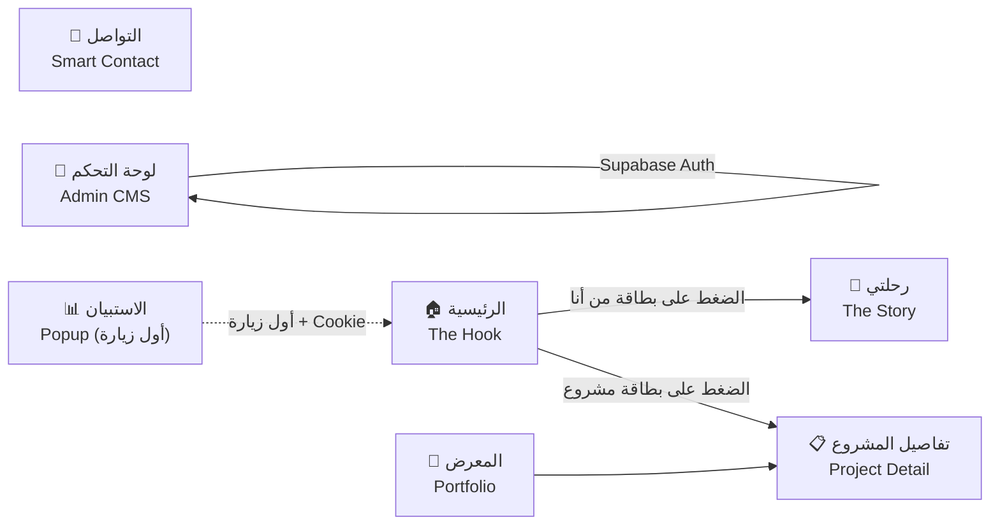

# 📄 Detailed Page-by-Page Specifications
## Advanced Personal Page — v1.3

---

## Page Map (خريطة الصفحات)



---

## Shared: الاستبيان المنبثق (Survey Popup)

> [!IMPORTANT]
> الاستبيان **ليس صفحة مستقلة** بل **Popup** يظهر تلقائياً عند **أول زيارة فقط**.

| العنصر | الوصف التفصيلي |
|---|---|
| **التفعيل** | يظهر تلقائياً عند أول زيارة للموقع |
| **منع التكرار** | استخدام **Cookies** — لا يظهر مجدداً لنفس المستخدم |
| **الشكل** | بطاقات احترافية (Card-based) — ليس نموذجاً تقليدياً |
| **الأسئلة** | كيفية معرفة الزائر بصاحب الموقع، أهداف الزائر |
| **أنواع الإجابات** | خيارات جاهزة (Multiple Choice) + حقل إجابة حرة (Free Text) |
| **التخطي** | إمكانية تخطي أي سؤال فردي أو الاستبيان بالكامل |
| **مبدأ UX** | عدم الإزعاج — تجربة ممتعة وليس عائقاً |

---

## PAGE-01: الصفحة الرئيسية — The Hook

### الهدف
جذب الزائر بصرياً من اللحظة الأولى وتقديم هوية صاحب الموقع بشكل فخم ومؤثر.

### الأقسام (Sections)

#### القسم 1: Hero — "من أنا"

| العنصر | الوصف التفصيلي |
|---|---|
| **النبذة التعريفية** | نص تعريفي يطفو بتأثير احترافي (Floating Text Animation) |
| **الشخصية 2.5D** | صورة شخصية **PNG شفاف** مُعالجة بتأثير 2.5D Parallax لإعطاء انطباع ثلاثي الأبعاد |
| **السلوك التفاعلي** | الشخصية تتفاعل مع حركة الماوس بتأخير (Inertia Physics) |
| **التنقل** | الضغط على هذا القسم → الانتقال إلى صفحة "رحلتي" |
| **اتجاه التخطيط** | RTL — النص يمين، الشخصية يسار (Desktop) — يتغير مع اللغة |

**Wireframe مبسّط (Desktop):**
```
┌─────────────────────────────────────────────┐
│   Navbar  [🌐 AR/EN] [🌙/☀️]               │
├──────────────────────┬──────────────────────┤
│                      │                      │
│   [نبذة تعريفية]          │   [شخصية 2.5D]        │
│   تطفو بأناقة             │   PNG شفاف            │
│                      │ تتبع الماوس بتأخير          │
│                      │                      │
├──────────────────────┴──────────────────────┤
│              ↓ الضغط = رحلتي                   │
└─────────────────────────────────────────────┘
```

**Wireframe مبسّط (Mobile):**
```
┌──────────────────────┐
│ Navbar [🌐] [🌙/☀️] │
├──────────────────────┤
│    [شخصية 2.5D]      │
│    (Touch Tilt)      │
├──────────────────────┤
│  [نبذة تعريفية]     │
│  تطفو بأناقة        │
├──────────────────────┤
│   ↓ الضغط = رحلتي   │
└──────────────────────┘
```

---

#### القسم 2: مشاريعي المختصر — Card Shuffle

| العنصر | الوصف التفصيلي |
|---|---|
| **نمط العرض** | **Card Shuffle (تكديس البطاقات)** عبر Framer Motion |
| **السلوك** | البطاقات مكدسة فوق بعضها وتتحرك بتأثير التبديل |
| **التوقيت** | تتنقل تلقائياً كل **5 ثوانٍ** |
| **محتوى البطاقة** | صورة تطفو بهدوء + تمويه خفيف (Blur) + نبذة مختصرة عن المشروع |
| **التفاعل** | الضغط على البطاقة → الانتقال لصفحة المشروع التفصيلية |
| **التحكم** | أزرار تنقل يدوي (Previous/Next) + مؤشرات (Dots) |
| **مصدر البيانات** | من Supabase عبر لوحة التحكم (CMS) |

**Wireframe (Desktop):**
```
┌─────────────────────────────────────────────┐
│              عنوان "مشاريعي"                    │
├─────────────────────────────────────────────┤
│                                             │
│          ┌──────────────┐                   │
│        ┌──────────────┐ │                   │
│      ┌──────────────┐ │ │                   │
│      │   📷 صورة    │ │─┘                   │
│      │   (تطفو)      │─┘     Card Shuffle    │
│      │   نبذة         │       ← Framer Motion │
│      └──────────────┘                       │
│              ● ● ○ ○ ○                      │
│                                             │
└─────────────────────────────────────────────┘
```

---

## PAGE-02: رحلتي — The Story

### الهدف
سرد الرحلة المهنية والشخصية بأسلوب قصصي إنساني عبر سجل زمني بصري.

### نقطة الوصول
الضغط على بطاقة "من أنا" في الصفحة الرئيسية.

### نمط العرض
**سجل زمني (Timeline) بأسلوب البطاقات المتتابعة.**

### بنية البطاقة الواحدة

| الحقل | الموقع | الوصف |
|---|---|---|
| **التاريخ** | أعلى البطاقة | تاريخ التعلم أو المشروع |
| **العمر** | بجانب التاريخ | عمر صاحب الموقع آنذاك |
| **الصورة** | يسار البطاقة | صورة المهارة أو المشروع المرتبط |
| **الملخص القصصي** | يمين البطاقة | محتوى إنساني: الدوافع، الظروف المحيطة، التأثير الشخصي |

> [!IMPORTANT]
> **قاعدة المحتوى:** التركيز على الجانب الإنساني والدوافع والظروف المحيطة بالإنجاز وتأثيره — **بعيداً عن التفاصيل التقنية المعقدة**.

**Wireframe (Desktop):**
```
┌─────────────────────────────────────────────┐
│                رحلتي                          │
├─────────────────────────────────────────────┤
│                    │                        │
│  2020 — عمري 18   ─●─  ┌──────────────────┐  │
│                    │  │ 📷    │  ملخص    │   │
│                    │  │ صورة  │  قصصي    │   │
│                    │  │       │  إنساني    │   │
│                    │  └──────────────────┘  │
│                    │                        │
│  2021 — عمري 19   ─●─  ┌──────────────────┐  │
│                    │  │ 📷    │   ملخص   │  │
│                    │  │ صورة  │  قصصي    │  │
│                    │  └──────────────────┘  │
│                    │                        │
│                   ...                       │
└─────────────────────────────────────────────┘
```

---

## PAGE-03: معرض المشاريع — Portfolio

### الهدف
عرض المشاريع بطريقة تُوحي بالفخامة والاحترافية.

### مصدر البيانات
**Supabase** — المشاريع تُدار بالكامل من لوحة التحكم (CMS).

### عرض القائمة (List View)

| العنصر | الموقع | الوصف |
|---|---|---|
| **ملخص المشروع** | اليمين | وصف مختصر للمشروع |
| **الصور** | اليسار | ثابتة أو متغيرة تلقائياً |
| **التفاعل** | — | الضغط على المشروع → صفحة تفصيلية |

**Wireframe (Desktop):**
```
┌─────────────────────────────────────────────┐
│              معرض المشاريع                 │
├─────────────────────────────────────────────┤
│  ┌────────────────────┬────────────────────┐│
│  │   ملخص المشروع 1   │          📷 صور  │ │
│  │   وصف مختصر         │  (ثابتة/متغيرة) │ │
│  └────────────────────┴────────────────────┘ │
│  ┌────────────────────┬────────────────────┐ │
│  │   ملخص المشروع 2   │          📷 صور  │ │
│  │ وصف مختصر       │    (ثابتة/متغيرة)   │ │
│  └────────────────────┴────────────────────┘ │
└─────────────────────────────────────────────┘
```

### صفحة المشروع التفصيلية (Project Detail)

| العنصر | الوصف |
|---|---|
| **رابط المعاينة** | رابط حي للمشروع (Preview Link) |
| **معرض الصور** | قابل للتقليب يدوياً أو تلقائياً كل 5 ثوانٍ |
| **التكبير** | Fullscreen Zoom مع الحفاظ على الأبعاد والجودة |
| **قصة التطوير** | سرد قصصي لعملية بناء المشروع |
| **المشاكل والحلول** | التحديات التي واجهت التطوير وكيف تم حلها |
| **سرعة البناء** | المدة الزمنية للتطوير |
| **المهارات والتقنيات** | قائمة بالتقنيات المستخدمة |
| **سبب الإنشاء** | الدافع وراء بناء المشروع |

---

## PAGE-04: التواصل — Smart Contact Form

### الهدف
تمكين الزوار من التواصل مع صاحب الموقع عبر نموذج ذكي واحترافي.

### نموذج التواصل الذكي (Smart Contact Form)

> [!IMPORTANT]
> **ليس نموذج تواصل تقليدي** — بل بطاقة زجاجية (Glassmorphism) تحتوي على حقول مدروسة لتسهيل اتخاذ قرار القبول/الرفض.

| العنصر | الوصف |
|---|---|
| **التصميم** | بطاقة **Glassmorphism** (خلفية زجاجية مموهة) |
| **الحقل 1** | الاسم والبريد الإلكتروني |
| **الحقل 2** | نوع الخدمة — قائمة منسدلة: `MVP`, `SaaS`, `AI Integration` |
| **الحقل 3** | الميزانية — خيارات: `$150-$500`, `$500-$1000`, `+$1000` |
| **الحقل 4** | تفاصيل الرسالة (Textarea) |
| **زر الإرسال** | **"ابدأ المشروع 🚀"** (ليس "إرسال") |
| **عند النجاح** | **Modal احتفالي** بنص: "تم استلام طلبك! سأقوم بدراسته والرد عليك خلال 24 ساعة بخطة عمل." |
| **الخلفية** | الرسالة تُحفظ في Supabase + تُرسل عبر **Resend** بكامل البيانات |

**Wireframe (Desktop):**
```
┌─────────────────────────────────────────────┐
│                                             │
│         ╔══════════════════════════╗        │
│         ║   📬 Smart Contact Form  ║        │
│         ║   ┌──────────────────┐   ║        │
│         ║   │    الاسم   │   البريد │   ║        │
│         ║   └──────────────────┘   ║        │
│         ║   ┌──────────────────┐   ║        │
│         ║   │ نوع الخدمة ▼        │   ║        │
│         ║   └──────────────────┘   ║        │
│         ║   ┌──────────────────┐   ║        │
│         ║   │ الميزانية             │   ║        │
│         ║   │ ○ $150-500       │   ║        │
│         ║   │ ○ $500-1000      │   ║        │
│         ║   │ ○ +$1000         │   ║        │
│         ║   └──────────────────┘   ║        │
│         ║   ┌──────────────────┐   ║        │
│         ║   │ تفاصيل الرسالة        │   ║        │
│         ║   │                  │   ║        │
│         ║   └──────────────────┘   ║        │
│         ║                          ║        │
│         ║   [  ابدأ المشروع 🚀  ]      ║        │
│         ╚══════════════════════════╝        │
│           ↑ Glassmorphism Card              │
└─────────────────────────────────────────────┘
```

### المساعدة والملاحظات (Feedback)

| العنصر | الوصف |
|---|---|
| **الغرض** | استقبال نصائح الزوار، شكاوى، أو ملاحظات تقنية |
| **الهدف** | تطوير الموقع بناءً على آراء الزوار |

---

## PAGE-05: لوحة التحكم — Admin Dashboard (CMS)

### الهدف
توفير واجهة إدارية كاملة لصاحب الموقع تشمل إدارة المحتوى (CMS).

### شرط الوصول
تسجيل دخول بحساب المالك الخاص عبر **Supabase Auth** (وحيد — ليس نظام مستخدمين متعدد).

### الأقسام

| القسم | الوظيفة |
|---|---|
| **إدارة المشاريع (CMS)** | 🆕 إضافة / تعديل / حذف المشاريع وصورها (يدعم ثنائية اللغة) |
| **إدارة الروابط** | تعديل روابط التواصل الاجتماعي (واتساب، لينكد إن، مستقل...) |
| **التحليلات** | تحليلات الاستبيان حسب الفئات + تحليلات سلوكية لتفاعل الزوار |
| **تصدير البيانات** | تحميل ملف JSON ببيانات الحسابات وإجاباتها الدقيقة |
| **صندوق الوارد** | قراءة رسائل الزوار والعملاء (Smart Contact Form) |
| **حالة البريد** | 🆕 مؤشر حالة الإرسال لكل رسالة: "تم الإرسال" / "فشل الإرسال" + زر "إعادة إرسال للبريد" يدوي |
| **إعادة التوجيه** | آلية تلقائية لتحويل الرسائل عبر **Resend** |

**Wireframe (Desktop):**
```
┌──────────┬──────────────────────────────────┐
│          │        لوحة التحكم              │
│  القائم ├──────────────────────────────────┤
│          │  ┌─────────┐  ┌─────────┐        │
│ • المشاريع│ │ إحصائية │ │   إحصائية │      │
│ • الروابط │  │   #1    │  │     #2    │       │
│ • التحليل   │  └─────────┘  └─────────┘       │
│ • الرسائل   │                                  │
│ • التصدير   │  ┌──────────────────────────┐   │
│ • الإعداد │  │   تحليلات الاستبيان       │   │
│          │  │   + تحليلات سلوكية        │   │
│          │  └──────────────────────────┘   │
│          │                                  │
│          │  ┌──────────────────────────┐   │
│          │  │   آخر الرسائل           │   │
│          │  └──────────────────────────┘   │
└──────────┴──────────────────────────────────┘
```

---

## العناصر المشتركة (Shared Components)

### Navbar (شريط التنقل)

| العنصر                | الوصف                                     |
| --------------------- | ----------------------------------------- |
| **التنقل**            | روابط: الرئيسية، المشاريع، التواصل، رحلتي |
| **Language Switcher** | 🌐 تبديل AR ↔ EN                          |
| **Theme Switcher**    | 🌙/☀️ تبديل Dark ↔ Light                  |

### Footer (التذييل)

| العنصر | الوصف |
|---|---|
| **الموقع** | أسفل كل صفحة — متاح دائماً |
| **المحتوى الثابت** | روابط: واتساب، لينكد إن، مستقل |
| **القابلية للتوسع** | بنية مرنة تسمح بإضافة وسائل تواصل جديدة بدون تعديل الكود الأساسي |
| **التصميم** | بسيط، لا يطغى على المحتوى |
