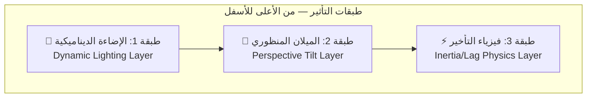

# 🎬 Animation & Motion Design Specifications
## Advanced Personal Page — v1.3

---

## 1. فلسفة الحركة (Motion Philosophy)

> **القاعدة الذهبية:** حركات بسيطة في الأقسام العامة، وتأثيرات حركية **"شديدة الاحترافية"** في الصفحات الرئيسية.

### تصنيف مستويات الحركة

| المستوى | الصفحات | الوصف |
|---|---|---|
| **Tier 1 — Subtle** | Footer, Navbar, لوحة التحكم | Fade-in، hover effects أساسية، transitions ناعمة |
| **Tier 2 — Rich** | — | (احتياطي للتوسع المستقبلي) |
| **Tier 3 — Cinematic** | الرئيسية، رحلتي، المشاريع، التواصل | فيزياء حركية كاملة، parallax، scroll-triggered animations |

---

## 2. تأثير 2.5D Parallax — المواصفات التقنية الكاملة

> **المصدر الأساسي:** `2.5D Parallax.md`
> **الموقع:** قسم Hero في الصفحة الرئيسية

> [!IMPORTANT]
> الصورة **ليست 3D فعلية** — بل صورة **PNG شفافة ثنائية الأبعاد** يتم تطبيق تقنيات بصرية عليها لإعطاء **انطباع** ثلاثي الأبعاد.

### 2.1 الطبقات الثلاث (Three-Layer System)



---

#### الطبقة 1: الإضاءة الديناميكية (Dynamic Lighting)

| المعيار | القيمة |
|---|---|
| **التقنية** | طبقة `div` فوق الصورة بتدرج لوني (Gradient) شفاف |
| **السلوك** | عندما يتحرك الماوس لليسار ← الإضاءة تتحرك لليمين (والعكس) |
| **الغرض** | خداع الدماغ ليظن أن الجسم يعكس الضوء لأنه "محدب" (3D) |

**التنفيذ المرجعي:**
```tsx
// Pseudo-code — Framer Motion
const lightX = useTransform(mouseX, [0, width], [100, 0]); // عكس الاتجاه

<motion.div
  className="light-overlay"
  style={{
    background: `radial-gradient(circle at ${lightX}% 50%, 
      rgba(255,255,255,0.15), transparent 60%)`,
    position: 'absolute',
    inset: 0,
    pointerEvents: 'none',
  }}
/>
```

---

#### الطبقة 2: الميلان المنظوري (Perspective Tilt)

| المعيار | القيمة |
|---|---|
| **التقنية** | CSS `transform: perspective() rotateX() rotateY()` |
| **الحد الأقصى للدوران** | **±15 درجة** (لمنع انكشاف أن الصورة مسطحة) |
| **الربط** | قيم الدوران مربوطة بموقع الماوس |
| **Perspective** | `1000px` |

**التنفيذ المرجعي:**
```tsx
// Pseudo-code — Framer Motion
const rotateX = useTransform(mouseY, [0, height], [15, -15]);
const rotateY = useTransform(mouseX, [0, width], [-15, 15]);

<motion.div
  style={{
    perspective: 1000,
    rotateX,
    rotateY,
    transformStyle: 'preserve-3d',
  }}
>
  {/* صورة PNG شفافة — ليست 3D فعلية */}
  <Image src="/images/character/character.png" alt="Personal Character" />
</motion.div>
```

---

#### الطبقة 3: فيزياء التأخير (Inertia / Lag Physics)

| المعيار               | القيمة                                                           |
| --------------------- | ---------------------------------------------------------------- |
| **التقنية**           | Linear Interpolation (Lerp) أو Spring Physics                    |
| **المعادلة الأساسية** | `currentX = lerp(currentX, targetX, 0.1)`                        |
| **السلوك**            | الشخصية لا تتحرك فوراً (1:1) مع الماوس بل تتبعها بـ "ثقل" ونعومة |
| **القيود**            | الشخصية لا تغادر البطاقة + لا تتجاوز "الأرضية الوهمية"           |
| **الأداة المفضلة**    | Framer Motion: `useSpring` + `useTransform`                      |

**التنفيذ المرجعي:**
```tsx
// Framer Motion — Spring Physics
const springConfig = { stiffness: 150, damping: 20, mass: 1 };

const characterX = useSpring(
  useTransform(mouseX, [0, width], [-20, 20]),
  springConfig
);

const characterY = useSpring(
  useTransform(mouseY, [0, height], [-10, 10]),
  springConfig
);

// البطاقة تتحرك بسرعة أعلى (spring أكثر صلابة)
const cardSpring = { stiffness: 300, damping: 25 };
const cardX = useSpring(useTransform(mouseX, ...), cardSpring);

// الفرق في الـ stiffness يخلق تأثير "التأخير" المطلوب
```

### 2.2 القيود الحركية (Motion Constraints)

| القيد                     | الوصف                                  |
| ------------------------- | -------------------------------------- |
| الشخصية لا تغادر البطاقة  | حدود حركة صارمة داخل إطار البطاقة      |
| لا تتجاوز الأرضية الوهمية | الشخصية لها "قاعدة" وهمية لا تخرج عنها |
| الزاوية القصوى ±15°       | لمنع كشف أن الصورة PNG مسطحة           |
| واقعي غير مبالغ فيه       | التأثير احترافي ورصين                  |

### 2.3 المكتبات المعتمدة

| المكتبة | الأولوية | الاستخدام |
|---|---|---|
| **Framer Motion** | 🥇 الخيار الأفضل | `useSpring`, `useTransform` — فيزياء الحركة الكاملة |
| **Atropos.js** | 🥈 خيار بديل | جعل الصور 2D تبدو 3D مع اللمس والماوس (تأثير Apple TV) |
| **Vanilla Tilt.js** | 🥉 خيار مبسّط | تأثير الميلان واللمعان (Glare) فقط |

---

## 3. تأثير تكديس البطاقات — Card Shuffle

> [!IMPORTANT]
> تم اعتماد تأثير **Card Shuffle (تكديس البطاقات)** لعرض المشاريع في الصفحة الرئيسية، يُنفذ بـ **Framer Motion**.

### المواصفات التقنية

| المعيار | القيمة |
|---|---|
| **التأثير** | البطاقات مكدسة فوق بعضها، البطاقة الأمامية تنزلق وتذهب للخلف |
| **التوقيت** | تتنقل كل **5 ثوانٍ** تلقائياً |
| **الأداة** | **Framer Motion** — `AnimatePresence` + `layout` animations |
| **الصور داخل البطاقة** | تطفو بهدوء (Gentle Float) |
| **التمويه** | تمويه خفيف (Subtle Blur Effect) على الصور |
| **التفاعل** | Hover → إيقاف مؤقت للتنقل التلقائي |
| **التحكم اليدوي** | Swipe (Mobile) + أزرار (Desktop) |

### ⚠️ تحذيرات تنفيذية (من مراجعة CTO)

> [!WARNING]
> **مشكلة `zIndex` أثناء الحركة:** عند استخدام `AnimatePresence` لتبديل البطاقات في كدسة الورق (Stack):
> 1. **يجب ضبط `zIndex` بدقة أثناء كل لحظة من الحركة** — وليس فقط في الحالة النهائية. إذا لم تفعل ذلك، ستتداخل البطاقات بشكل قبيح (Clipping).
> 2. **استخدم `layoutId`** بحذر — تأكد أن كل بطاقة لها `layoutId` فريد ومستقر.
> 3. **تأثير الخروج (Exit):** البطاقة التي تخرج يجب أن تختفي بـ `opacity: 0` و `scale: 0.9` لإعطاء إيحاء أنها **رجعت للخلف**، وليس أنها اختفت فجأة.

**التنفيذ المرجعي (مُحسّن):**
```tsx
// Framer Motion — Card Shuffle (مُحسّن بناءً على مراجعة CTO)
<AnimatePresence mode="popLayout">
  {cards.map((card, i) => (
    <motion.div
      key={card.id}
      layoutId={`project-card-${card.id}`}  // ⚠️ layoutId ثابت وفريد
      layout
      initial={{ scale: 0.95, y: 20, opacity: 0 }}
      animate={{
        scale: 1 - i * 0.05,    // كل بطاقة أصغر قليلاً
        y: i * -10,               // إزاحة عمودية
        zIndex: cards.length - i, // ⚠️ ضبط zIndex بدقة لمنع Clipping
        opacity: 1,
      }}
      exit={{
        scale: 0.9,               // ⚠️ تصغير → إيحاء بالرجوع للخلف
        opacity: 0,               // ⚠️ اختفاء تدريجي (ليس فجائي)
        zIndex: 0,                // ⚠️ إرسال للخلف أثناء الخروج
      }}
      transition={{ type: "spring", stiffness: 300, damping: 30 }}
      style={{ position: 'absolute' }}  // ⚠️ ضروري لمنع تداخل Layout
    >
      <ProjectCard {...card} />
    </motion.div>
  ))}
</AnimatePresence>
```

---

## 4. حركات بطاقات الاستبيان (Survey Popup Cards)

| المعيار | القيمة |
|---|---|
| **النمط** | بطاقات احترافية (Card-based UI) داخل Popup overlay |
| **الظهور** | Fade-in + Scale-up ناعم |
| **الانتقال** | Smooth card transition عند الانتقال للسؤال التالي |
| **التخطي** | تأثير swipe / dismiss ناعم |
| **الإغلاق** | Fade-out + Scale-down |

---

## 5. حركات معرض الصور (Gallery Animations)

### في صفحة المشروع التفصيلي

| المعيار | القيمة |
|---|---|
| **التقليب اليدوي** | Smooth slide transition |
| **التنقل التلقائي** | كل **5 ثوانٍ** |
| **التكبير (Fullscreen Zoom)** | Scale animation مع overlay مظلم |
| **الخروج من التكبير** | Fade-out أو pinch-to-close |
| **الحفاظ على الجودة** | الأبعاد والجودة لا تتأثر عند التكبير |

---

## 6. حركات السجل الزمني (Timeline Animations)

| المعيار | القيمة |
|---|---|
| **نوع التفعيل** | Scroll-triggered (تظهر عند الوصول إليها) |
| **تأثير الظهور** | Fade-in + Slide from side |
| **التتابع** | Staggered — كل بطاقة تظهر بتأخير عن السابقة |
| **الاتجاه** | Alternate sides (يمين ← يسار ← يمين...) — Desktop |
| **Mobile** | Slide from bottom — اتجاه واحد |

---

## 7. الحركات العامة (Global Animations)

### قسم "من أنا" — النص الطافي

| المعيار | القيمة |
|---|---|
| **التأثير** | النبذة التعريفية تطفو بتأثير احترافي |
| **التقنية** | Float animation مع subtle Y-axis oscillation |
| **السرعة** | بطيئة وناعمة (≈ 3-4 ثوانٍ لكل دورة) |

### Modal الاحتفالي (Success Celebration)

| المعيار | القيمة |
|---|---|
| **التأثير** | عند إرسال Smart Contact Form بنجاح |
| **الظهور** | Fade-in + Scale-up bounce |
| **المحتوى** | رسالة تأكيد + تأثير confetti خفيف (مستنتج) |

### Hover Effects العامة

| العنصر | التأثير |
|---|---|
| **البطاقات** | `translateY(-4px)` + تعزيز الظل |
| **الأزرار** | `translateY(-2px)` + brightness increase |
| **الروابط** | Color transition + underline animation |

### Page Transitions

| المعيار | القيمة |
|---|---|
| **بين الصفحات** | Fade transition |
| **المدة** | 300–500ms |
| **Easing** | `ease-in-out` |

---

## 8. اعتبارات الأداء (Performance Considerations)

| القاعدة | التفاصيل |
|---|---|
| **GPU Acceleration** | استخدام `will-change` و `transform` بدلاً من خصائص تُسبب reflow |
| **Reduced Motion** | احترام `prefers-reduced-motion` — تعطيل الحركات الثقيلة |
| **Mobile Optimization** | تبسيط أو تعطيل 2.5D Parallax على الهواتف لصالح الأداء |
| **Lazy Loading** | تحميل مكونات الحركة بشكل Dynamic Import |
| **Frame Rate** | استهداف 60fps كحد أدنى لجميع الحركات |

### 🆕 استراتيجية الموبايل للـ 2.5D (Conditional Loading)

> [!WARNING]
> **لا تقم بتشغيل mousemove/touch Listeners على الموبايل حتى لو كان التأثير بسيطاً.** هذا يستهلك البطارية ويضر Performance Score.

**الحل:** استخدم `useMediaQuery` لتحميل مكون مختلف حسب الجهاز:

```tsx
// Conditional Component Loading
const isMobile = useMediaQuery('(max-width: 768px)');

return isMobile ? (
  // 📱 الموبايل: صورة ثابتة بدون أي Listeners
  <StaticCharacterImage />
) : (
  // 🖥️ الديسكتوب: التأثير التفاعلي الكامل (2.5D Parallax)
  <InteractiveCharacterParallax />
);
```

| الجهاز | المكون | السلوك |
|---|---|---|
| **الموبايل (< 768px)** | `StaticCharacterImage` | صورة PNG ثابتة — بدون Listeners، بدون Spring، بدون استهلاك بطارية |
| **الديسكتوب (≥ 1024px)** | `InteractiveCharacterParallax` | تأثير 2.5D كامل (إضاءة + ميلان + فيزياء) |
