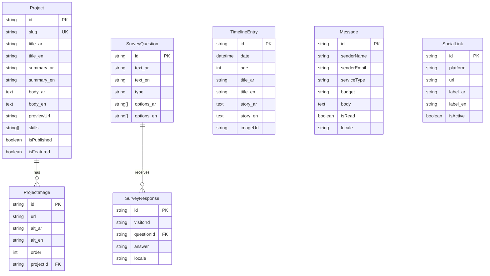

# 🗃️ API Endpoints & Data Model
## Advanced Personal Page — v1.3

---

## 1. نموذج البيانات (Data Model)

### 1.1 مخطط Prisma (Prisma Schema)

```prisma
// ==============================================
// Advanced Personal Page — Prisma Schema v1.3
// Database: Supabase (PostgreSQL)
// Auth: Supabase Auth (خارج Prisma — يُدار من Supabase)
// ==============================================

generator client {
  provider = "prisma-client-js"
}

datasource db {
  provider  = "postgresql"
  url       = env("DATABASE_URL")     // Supabase connection string
  directUrl = env("DIRECT_URL")       // Supabase direct connection (for migrations)
}

// ─────────────────────────────────────────────
// روابط التواصل الاجتماعي
// ─────────────────────────────────────────────
model SocialLink {
  id        String   @id @default(cuid())
  platform  String                              // whatsapp, linkedin, mostaql, etc.
  url       String
  label_ar  String                              // 🆕 التسمية بالعربية
  label_en  String                              // 🆕 التسمية بالإنجليزية
  icon      String?                             // اسم الأيقونة أو مسارها
  order     Int      @default(0)                // ترتيب العرض
  isActive  Boolean  @default(true)

  createdAt DateTime @default(now())
  updatedAt DateTime @updatedAt
}

// ─────────────────────────────────────────────
// المشاريع — تُدار بالكامل من CMS
// ─────────────────────────────────────────────
model Project {
  id          String   @id @default(cuid())
  slug        String   @unique                   // للـ URL: /portfolio/{slug}
  title_ar    String                              // 🆕 العنوان بالعربية
  title_en    String                              // 🆕 العنوان بالإنجليزية
  summary_ar  String                              // 🆕 الملخص بالعربية
  summary_en  String                              // 🆕 الملخص بالإنجليزية
  body_ar     String   @db.Text                   // 🆕 الوصف الكامل بالعربية
  body_en     String   @db.Text                   // 🆕 الوصف الكامل بالإنجليزية
  previewUrl  String?                             // رابط المعاينة
  skills      String[]                            // التقنيات المستخدمة
  buildTime   String?                             // مدة البناء (مثال: "أسبوعان")
  order       Int      @default(0)                // ترتيب العرض
  isPublished Boolean  @default(false)
  isFeatured  Boolean  @default(false)             // 🆕 لعرض "أفضل المشاريع" في الصفحة الرئيسية

  images      ProjectImage[]

  createdAt   DateTime @default(now())
  updatedAt   DateTime @updatedAt
}

model ProjectImage {
  id        String  @id @default(cuid())
  url       String                                // رابط الصورة (Supabase Storage)
  alt_ar    String?                               // 🆕 النص البديل بالعربية
  alt_en    String?                               // 🆕 النص البديل بالإنجليزية
  order     Int     @default(0)
  projectId String
  project   Project @relation(fields: [projectId], references: [id], onDelete: Cascade)
}

// ─────────────────────────────────────────────
// السجل الزمني (Timeline)
// ─────────────────────────────────────────────
model TimelineEntry {
  id          String   @id @default(cuid())
  date        DateTime
  age         Int                                  // العمر آنذاك
  title_ar    String                               // 🆕 العنوان بالعربية
  title_en    String                               // 🆕 العنوان بالإنجليزية
  story_ar    String   @db.Text                    // 🆕 الملخص القصصي بالعربية
  story_en    String   @db.Text                    // 🆕 الملخص القصصي بالإنجليزية
  imageUrl    String?
  order       Int      @default(0)

  createdAt   DateTime @default(now())
  updatedAt   DateTime @updatedAt
}

// ─────────────────────────────────────────────
// أسئلة الاستبيان
// ─────────────────────────────────────────────
model SurveyQuestion {
  id           String   @id @default(cuid())
  text_ar      String                              // 🆕 نص السؤال بالعربية
  text_en      String                              // 🆕 نص السؤال بالإنجليزية
  type         String                              // multiple_choice | free_text
  options_ar   String[]                            // 🆕 الخيارات بالعربية
  options_en   String[]                            // 🆕 الخيارات بالإنجليزية
  order        Int      @default(0)
  isRequired   Boolean  @default(false)
  isActive     Boolean  @default(true)

  responses    SurveyResponse[]

  createdAt    DateTime @default(now())
  updatedAt    DateTime @updatedAt
}

// ─────────────────────────────────────────────
// إجابات الاستبيان
// ─────────────────────────────────────────────
model SurveyResponse {
  id           String   @id @default(cuid())
  visitorId    String                              // معرّف مجهول للزائر (Cookie-based)
  questionId   String
  question     SurveyQuestion @relation(fields: [questionId], references: [id])
  answer       String                              // الإجابة (سواء خيار أو نص حر)
  locale       String   @default("ar")             // 🆕 لغة الزائر عند الإجابة

  createdAt    DateTime @default(now())
}

// ─────────────────────────────────────────────
// الرسائل — Smart Contact Form
// ─────────────────────────────────────────────
model Message {
  id          String   @id @default(cuid())
  senderName  String
  senderEmail String
  serviceType String                               // MVP | SaaS | AI Integration
  budget      String                               // $150-$500 | $500-$1000 | +$1000
  body        String   @db.Text
  isRead      Boolean  @default(false)
  emailStatus String   @default("pending")         // 🆕 حالة الإرسال: pending | sent | failed
  locale      String   @default("ar")              // 🆕 لغة الزائر عند الإرسال

  createdAt   DateTime @default(now())
}

// ─────────────────────────────────────────────
// ❌ InteractionEvent — تم إلغاؤه (v1.2)
// السبب: قنبلة أداء (كل زيارة = Write Operation) + مخاوف GDPR
// البديل: Vercel Analytics (مجاني، لا يستهلك قاعدة البيانات)
// ─────────────────────────────────────────────
```

### 1.2 مخطط العلاقات (ER Diagram)



---

## 2. واجهة برمجة التطبيقات (API Specifications)

### 2.1 المصادقة (Authentication)

> **التقنية: Supabase Auth**
> لا حاجة لبناء نظام مصادقة مخصص — Supabase يوفر:
> - `signInWithPassword` — تسجيل الدخول
> - `signOut` — تسجيل الخروج
> - Session management تلقائي

> [!CAUTION]
> **تعطيل التسجيل (Sign-up):** يجب تعطيل خاصية التسجيل من Supabase Dashboard لمنع أي شخص من إنشاء حساب. يتم إنشاء المستخدم الوحيد (المالك) يدوياً من لوحة تحكم Supabase، وكود الواجهة يدعم `signIn` فقط وليس `signUp`.

| العملية | الآلية |
|---|---|
| تسجيل الدخول | `supabase.auth.signInWithPassword({ email, password })` |
| تسجيل الخروج | `supabase.auth.signOut()` |
| التحقق من الجلسة | `supabase.auth.getSession()` |
| حماية API Routes | Middleware يتحقق من Supabase Session |
| ❗ التسجيل | **معطّل** — Invite Only / إنشاء يدوي فقط |

### 2.1.1 🆕 سياسات RLS (Row Level Security)

> [!WARNING]
> الاعتماد على Middleware فقط غير كافٍ إذا كان ال Client يتصل بـ Supabase مباشرة. **يجب تفعيل RLS على جميع الجداول.**

| الجدول | SELECT (قراءة) | INSERT (كتابة) | UPDATE / DELETE |
|---|---|---|---|
| `Project` | ✅ للجميع (anon) | 🔒 authenticated فقط | 🔒 authenticated فقط |
| `ProjectImage` | ✅ للجميع (anon) | 🔒 authenticated فقط | 🔒 authenticated فقط |
| `TimelineEntry` | ✅ للجميع (anon) | 🔒 authenticated فقط | 🔒 authenticated فقط |
| `SocialLink` | ✅ للجميع (anon) | 🔒 authenticated فقط | 🔒 authenticated فقط |
| `SurveyQuestion` | ✅ للجميع (anon) | 🔒 authenticated فقط | 🔒 authenticated فقط |
| `SurveyResponse` | 🔒 authenticated فقط | ✅ للجميع (anon) | ❌ ممنوع |
| `Message` | 🔒 authenticated فقط | ✅ للجميع (anon) | 🔒 authenticated فقط |

---

### 2.2 API العامة (Public Endpoints)

#### `GET /api/projects`
**الغرض:** جلب قائمة المشاريع المنشورة
**Query Params:** `?featured=true` لجلب المشاريع المميزة فقط (للصفحة الرئيسية)
```json
// Response 200
{
  "projects": [
    {
      "id": "...",
      "slug": "my-saas-project",
      "title_ar": "مشروعي الأول",
      "title_en": "My First Project",
      "summary_ar": "ملخص المشروع...",
      "summary_en": "Project summary...",
      "skills": ["Next.js", "Supabase"],
      "images": [
        { "url": "https://...", "alt_ar": "...", "alt_en": "..." }
      ]
    }
  ]
}
```

#### `GET /api/projects/:slug`
**الغرض:** جلب تفاصيل مشروع واحد
```json
// Response 200
{
  "project": {
    "id": "...",
    "slug": "my-saas-project",
    "title_ar": "...",
    "title_en": "...",
    "body_ar": "القصة الكاملة...",
    "body_en": "Full story...",
    "previewUrl": "https://...",
    "skills": ["..."],
    "buildTime": "أسبوعان",
    "images": [...]
  }
}
```

#### `GET /api/timeline`
**الغرض:** جلب إدخالات السجل الزمني
```json
// Response 200
{
  "entries": [
    {
      "id": "...",
      "date": "2020-01-15",
      "age": 18,
      "title_ar": "بداية تعلم البرمجة",
      "title_en": "Started Learning Programming",
      "story_ar": "...",
      "story_en": "...",
      "imageUrl": "https://..."
    }
  ]
}
```

#### `GET /api/social-links`
**الغرض:** جلب روابط التواصل النشطة
```json
// Response 200
{
  "links": [
    {
      "platform": "whatsapp",
      "url": "https://...",
      "label_ar": "واتساب",
      "label_en": "WhatsApp",
      "icon": "whatsapp"
    }
  ]
}
```

---

### 2.3 API التفاعل (Interaction Endpoints)

#### `GET /api/survey/questions`
**الغرض:** جلب أسئلة الاستبيان النشطة
```json
// Response 200
{
  "questions": [
    {
      "id": "...",
      "text_ar": "كيف عرفت عني؟",
      "text_en": "How did you find me?",
      "type": "multiple_choice",
      "options_ar": ["LinkedIn", "GitHub", "أخرى"],
      "options_en": ["LinkedIn", "GitHub", "Other"],
      "isRequired": false
    }
  ]
}
```

#### `POST /api/survey/responses`
**الغرض:** حفظ إجابات الاستبيان
```json
// Request
{
  "visitorId": "anonymous-uuid",
  "locale": "ar",
  "responses": [
    { "questionId": "...", "answer": "LinkedIn" },
    { "questionId": "...", "answer": "نص حر..." }
  ]
}

// Response 201
{ "success": true }
```

#### `POST /api/messages`
**الغرض:** إرسال رسالة من Smart Contact Form

```json
// Request
{
  "senderName": "أحمد",
  "senderEmail": "ahmed@example.com",
  "serviceType": "SaaS",
  "budget": "$500-$1000",
  "body": "أريد بناء منصة SaaS لإدارة المخزون...",
  "locale": "ar"
}

// Response 201
{ "success": true, "message": "تم استلام طلبك بنجاح" }
```

> **Side Effect:** الرسالة تُحفظ في Supabase + تُرسل عبر **Resend** لبريد المالك.
> فشل الإرسال عبر Resend **لا يمنع** حفظ الرسالة — يُسجّل كخطأ فقط.

> [!NOTE]
> **التحليلات السلوكية** (page views, clicks, etc.) تُدار عبر **Vercel Analytics** وليس عبر API مخصص.
> هذا يمنع إرهاق قاعدة البيانات ويوفر رسوماً بيانية أفضل مجاناً.

---

### 2.4 API الإدارة (Admin Endpoints — Protected)

> جميع endpoints التالية تتطلب **Supabase Auth Session** صالحة.

#### المشاريع (CMS)

| Method | Endpoint | الوصف |
|---|---|---|
| `GET` | `/api/admin/projects` | قائمة كل المشاريع (بما فيها غير المنشورة) |
| `POST` | `/api/admin/projects` | 🆕 إضافة مشروع جديد |
| `PUT` | `/api/admin/projects/:id` | تعديل مشروع |
| `DELETE` | `/api/admin/projects/:id` | حذف مشروع |

> [!WARNING]
> **سياسة الحذف (Orphan Cleanup):** عند حذف مشروع، يجب حذف الملفات الفعلية من Supabase Storage (الـ Bucket) إلى جانب حذف السجل من DB. عدم القيام بذلك يترك صوراً "يتيمة" تستهلك مساحة.

> [!NOTE]
> **سياسة الـ Slug:** عند إضافة مشروع، إذا كان الـ slug موجوداً مسبقاً (تكرار)، يجب إضافة رقم عشوائي تلقائياً (`my-project-2`, `my-project-3`) أو طلب من المستخدم تغييره قبل الحفظ، لمنع خطأ Prisma Unique Constraint.

**`POST /api/admin/projects` — إضافة مشروع:**
```json
// Request (multipart/form-data for image upload)
{
  "title_ar": "...",
  "title_en": "...",
  "summary_ar": "...",
  "summary_en": "...",
  "body_ar": "...",
  "body_en": "...",
  "previewUrl": "...",
  "skills": ["Next.js", "Supabase"],
  "buildTime": "أسبوعان",
  "isPublished": true,
  "isFeatured": true,          // 🆕 لعرضه في الصفحة الرئيسية
  "images": [File, File, ...]  // تُرفع إلى Supabase Storage
}
```

#### السجل الزمني

| Method | Endpoint | الوصف |
|---|---|---|
| `GET` | `/api/admin/timeline` | قائمة كل إدخالات السجل |
| `POST` | `/api/admin/timeline` | إضافة إدخال |
| `PUT` | `/api/admin/timeline/:id` | تعديل إدخال |
| `DELETE` | `/api/admin/timeline/:id` | حذف إدخال |

#### الروابط الاجتماعية

| Method | Endpoint | الوصف |
|---|---|---|
| `GET` | `/api/admin/social-links` | قائمة الروابط |
| `PUT` | `/api/admin/social-links` | تحديث الروابط (Batch) |

#### التحليلات

| Method | Endpoint | الوصف |
|---|---|---|
| `GET` | `/api/admin/analytics/survey` | تحليلات الاستبيان حسب الفئات |
| `GET` | `/api/admin/analytics/export` | تصدير JSON كامل لبيانات الاستبيان |

> [!NOTE]
> التحليلات السلوكية (page views, clicks, referrers) تتوفر عبر **Vercel Analytics Dashboard** مباشرة — لا حاجة لـ API مخصص.

#### الرسائل

| Method | Endpoint | الوصف |
|---|---|---|
| `GET` | `/api/admin/messages` | قائمة الرسائل (مع ترقيم الصفحات) |
| `PUT` | `/api/admin/messages/:id/read` | تحديد كمقروءة |
| `DELETE` | `/api/admin/messages/:id` | حذف رسالة |
| `POST` | `/api/admin/messages/:id/resend` | 🆕 إعادة إرسال البريد يدوياً (عند فشل Resend) |

---

## 3. سياسات إضافية

### سياسة إعادة توجيه البريد (Email Forwarding)

| المعيار | القيمة |
|---|---|
| **الخدمة** | **Resend** |
| **التفعيل** | تلقائي عند كل رسالة جديدة |
| **محتوى البريد** | كامل البيانات: الاسم، البريد، نوع الخدمة، الميزانية، التفاصيل |
| **الهدف** | تمكين المالك من اتخاذ قرار القبول/الرفض بناءً على البيانات |
| **سلوك الفشل** | فشل Resend **لا يمنع** حفظ الرسالة في قاعدة البيانات |

### سياسة الـ SEO

| المعيار | القيمة |
|---|---|
| **Meta Tags** | ديناميكية لكل صفحة — `title`, `description`, `og:image` |
| **Sitemap** | `sitemap.xml` مُولّد تلقائياً من Next.js |
| **Robots** | `robots.txt` يسمح بالزحف لجميع الصفحات العامة |
| **Structured Data** | JSON-LD للمشاريع (`SoftwareApplication`) والملف الشخصي (`Person`) |
| **Open Graph** | لكل صفحة — يدعم المشاركة على السوشال ميديا |
| **i18n SEO** | `hreflang` tags لربط النسخ العربية والإنجليزية |

### سياسة حماية الـ API — Rate Limiting

> [!CAUTION]
> بدون Rate Limiting، يمكن لبوت إرسال آلاف الرسائل عبر Resend وحرق الرصيد.

| المعيار | القيمة |
|---|---|
| **الأداة** | **Upstash Rate Limit** (مجاني مع Next.js) |
| **حد الرسائل** | **5 رسائل لكل IP في الساعة** |
| **حد الاستبيان** | **3 إرسالات لكل IP في الساعة** |
| **الـ Endpoints المحمية** | `POST /api/messages` + `POST /api/survey/responses` |
| **الاستجابة عند التجاوز** | HTTP `429 Too Many Requests` |
| **التخزين** | Upstash Redis (Serverless — مدمج مع Vercel) |

### سياسة التحليلات (Analytics)

| المعيار | القيمة |
|---|---|
| **التحليلات السلوكية** | **Vercel Analytics** (مجاني، لا يستهلك DB) |
| **تحليلات الاستبيان** | من قاعدة البيانات (Supabase) عبر Admin API |
| **الخصوصية** | لا يتم تخزين IP أو بيانات شخصية في قاعدة البيانات |
| **السبب** | تجنب قنبلة الأداء (Write per visit) ومخاوف GDPR |
